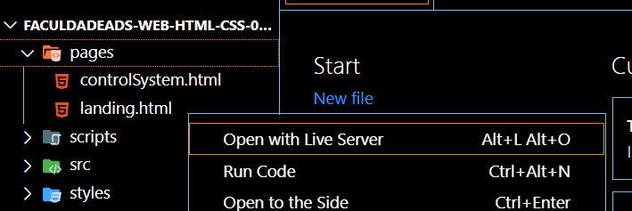
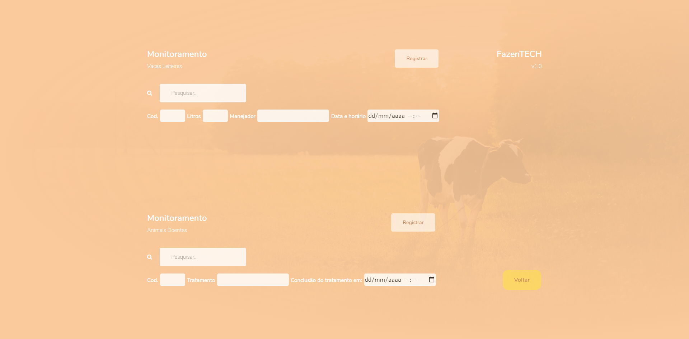

Programação para Web I
Na fazenda de Lúcia, a produção de leite não possui nenhum tipo de monitoramento, sendo que muitas vezes esta falta de acompanhamento faz com que ocorra uma grande perda de produto, gerando assim prejuízo. Para minimizar estas perdas, Lúcia pretende melhorar o monitoramento da produção leiteira, sendo que sua primeira atitude foi codificar as vacas leiteiras, através de um código numérico, assim poderá ter o controle de qual animal já realizou o processo de ordenha.
A tecnologia que Lúcia pretende implementar, para realizar o monitoramento da produção de leite, é um sistema web. O sistema deve cadastrar cada vaca leiteira e a sua quantidade de leite diária, sendo necessário cadastrar também quem realizou o manejo e o horário respectivo.
Outra funcionalidade pedida foi o monitoramento dos animais doentes, sendo necessário o cadastro do animal, o tratamento utilizando e os dias necessários para cumprir o tratamento.
Uma característica que Lúcia pediu, foi que o sistema seja simples, otimize o trabalho e tenha uma interface agradável. Sabendo dos requisitos pedidos, você ficou responsável por desenvolver a interface do sistema, utilizando as linguagens HTML e CSS.

<strong>Iniciando Projeto</strong>

  

<strong>Páginas</strong>

  

    

